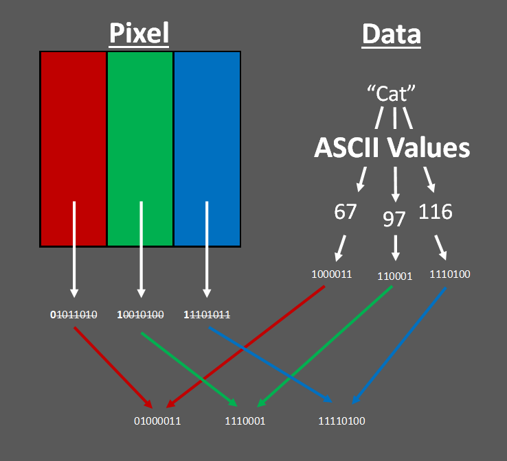
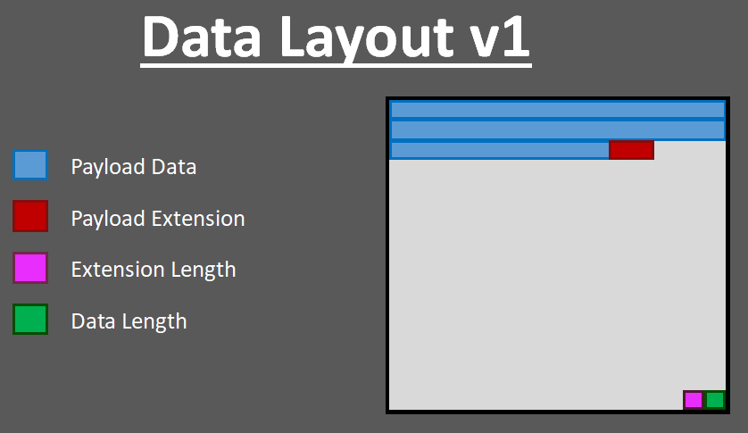
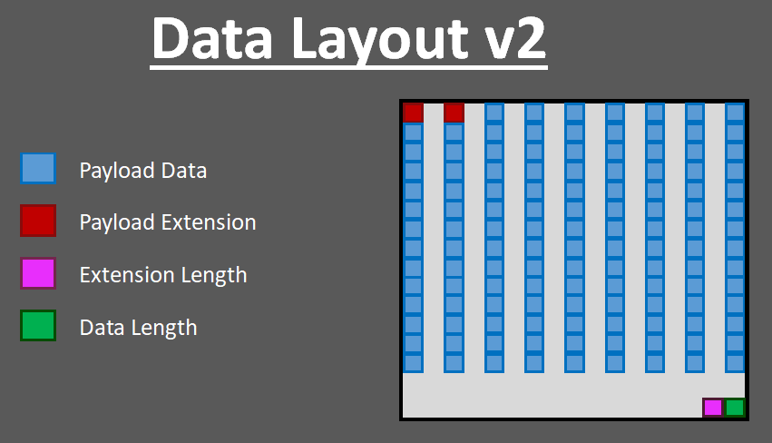

# Picture Encoder
## Picture Encoder v1
### Related Files/Folders
* encoder.py
* decoder.py
* payloads
* images
* outputs

### Description
**Picture Encoder v1** takes a given file using characters from the ASCII table *(.txt, .java, .py, etc.)* and encodes the file in a given png image. 

### How it Works
**Picture Encoder v1** encodes the payload by taking each character of the file and encoding it within each "sub-pixel" of the picture. Each pixel has corresponding RGB values, each being 8 bits long. This program takes those color values and keeps the most significant bit, while appending the binary ASCII value (7 bits) of the current character being encoded from the payload. This means that in each pixel, 3 bits of information for the original color is being saved when being used for encoding.

### Data Layout
The layout of the data within the image is set in a specific way. The last pixel (right-bottom) of the image uses the three values to specify how long the payload data section is in base-256. For example, if the last pixel's RGB value read as (0, 3, 145), then that means the payload data section was 913 characters long. The second-to-last pixel tells how long the payload extension is using the same method (even though there will probably never be a case in which all values are used for the length of an extension).
  
The payload data starts at the first pixel (top-left) of the image and is encoding from left to right and then top to bottom. The payload extension is encoded directly after the payload data.

### Result
This result is a picture of my cat encoded with the entire Bible. 

## Picture Encoder v2
### Related Files/Folders
* encoder2.py
* decoder2.py
* payloads
* images
* outputs

### Description
**Picture Encoder v2** takes a given file using characters from the ASCII table *(.txt, .java, .py, etc.)* and encodes the file in a given png image. 

### How it Works
*Same as version 1*

### Data Layout
The layout of the data within the image is set in a specific way. The last pixel (right-bottom) of the image uses the three values to specify how long the payload data section is in base-256. For example, if the last pixel's RGB value read as (0, 3, 145), then that means the payload data section was 913 characters long. The second-to-last pixel tells how long the payload extension is using the same method (even though there will probably never be a case in which all values are used for the length of an extension).
  
The payload extension starts at the first pixel (top-left) of the image and is encoding from left to right and then top to bottom. The payload data is encoded directly after the payload data. This is a reverse in order from version 1 and was due to convenience in coding. The <u>**core feature of version 2**</u> is that based on the image's resolution and the size of the payload, a "spacing" variable is calcuated and used to space the data as much as possible (with this more-simple calculation). This makes it less noticeable in certain cases compared to version 1.

### Comparison
The two pictures being compared are pictures of my cat both encoded with the entire Bible.
| Version 1 | Version 2 |
|---------|---------|
|  |  |